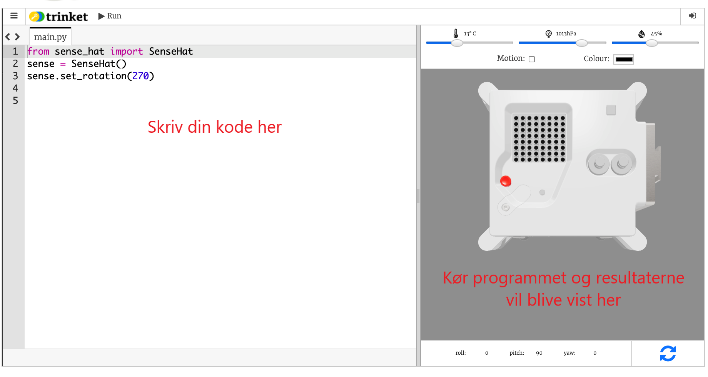

## Hvad er en Astro Pi?

En Astro Pi er en Raspberry Pi-computer indkapslet i et kabinet, der er specialdesignet til forhold i rummet. Den har også et tilsætningsbræt, der kaldes Sense HAT og er specialfremstillet til Astro Pi-missionen. Sense HAT har et joystick, et LED-display og sensorer til optagelse af temperatur, fugtighed, tryk og retning.

Her er en rigtig Astro Pi-enhed på den internationale rumstation, der kører nogle koder skrevet af eleverne. Det er her, din kode bliver kørt til sidst! 

<iframe src="https://player.vimeo.com/video/172737314" width="640" height="360" frameborder="0" webkitallowfullscreen mozallowfullscreen allowfullscreen mark="crwd-mark"></iframe> 

Til denne mission kommer du til at anvende Sense HAT-efterligneren. Efterligneren er software, der simulerer alle funktionerne i Astro Pi i din webbrowser.

Der er nogle få forskelle mellem den rigtige Sense HAT og efterligningen af den:

- På efterligningen af den kan du selv indstille temperatur, tryk og fugtighed ved hjælp af skydere, hvorimod den rigtige Sense HAT i Astro Pi anvender sensorer til at måle disse parametre i sine omgivelser.

- Du kan anvende musen til at klikke på og trække i efterligningen af Sense HAT for at flytte og dreje den, så der simuleres ændringer af dens retning; den rigtige Astro Pi (og dens Sense HAT) kan bevæge sig i den virkelige verden, og retningssensorerne på Sense HAT registrerer, hvornår og hvordan den har bevæget sig.