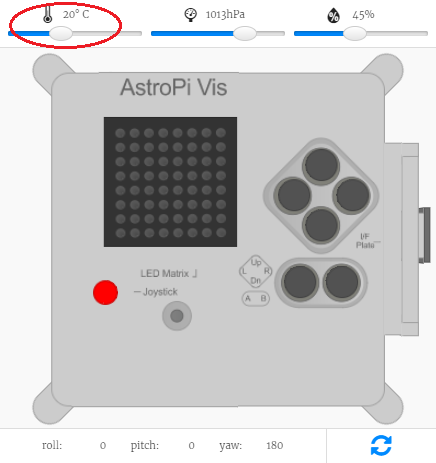

## Μέτρηση της θερμοκρασίας

Ο αισθητήρας θερμοκρασίας στο Astro Pi μπορεί να μετρήσει τη θερμοκρασία του αέρα που τον περιβάλλει, μια χρήσιμη δυνατότητα που σας βοηθά να συλλέξετε δεδομένα για τις διαστημικές συνθήκες.


Ο Astro Pi μετρά τη θερμοκρασία στον Διεθνή Διαστημικό Σταθμό σε βαθμούς Κελσίου (&deg;C). Καθώς οι θερμοκρασίες στο διάστημα διαφέρουν κατά πολύ σε σχέση με τις θερμοκρασίες στη Γη, ο Astro Pi μπορεί να μετρήσει θερμοκρασίες από -40 βαθμούς Κελσίου έως και +120 βαθμούς Κελσίου.

Μέρος της αποστολής σας είναι να συμβάλετε στην καθημερινή ζωή του πληρώματος στον Διεθνή Διαστημικό Σταθμό. Αν τους ενημερώσετε ότι η θερμοκρασία στον διαστημικό σταθμό είναι εντός του φυσιολογικού εύρους, θα τους καθησυχάσετε.

--- collapse ---
---
title: Τι είναι η θερμοκρασία;
---

Θερμοκρασία είναι το φυσικό μέγεθος που μετρά πόσο ζεστό είναι κάτι. Ίσως ένας γιατρός να έχει μετρήσει και τη δική σας θερμοκρασία χρησιμοποιώντας ένα θερμόμετρο.

 *By Menchi [CC-BY-SA-3.0](http://creativecommons.org/licenses/by-sa/3.0/){:target="_blank"} via Wikimedia Commons*

Πιο συγκεκριμένα, η θερμοκρασία είναι το φυσικό μέγεθος που μετρά την ποσότητα της θερμικής ενέργειας μιας ουσίας. Γνωρίζετε ότι ένα παγάκι είναι στερεό, αλλά όσο ζεσταίνεται, όσο δηλαδή απορροφά θερμική ενέργεια από το περιβάλλον του, λιώνει και μετατρέπεται σε υγρό. Αυτό οφείλεται στο γεγονός ότι,όταν μια ουσία απορροφά ή χάνει αρκετή θερμική ενέργεια, η ουσία αλλάζει κατάσταση, για παράδειγμα από στερεή γίνεται υγρή.

--- /collapse ---

--- task --

Προσθέστε τον παρακάτω κώδικα για να λάβετε μια μέτρηση της θερμοκρασίας:

```python
temp = sense.temperature
```

Η γραμμή αυτή θα μετρήσει την τρέχουσα θερμοκρασία και θα αποθηκεύσει την τιμή μέτρησης στη μεταβλητή `temp`.

--- /task ---

--- task --

Η θερμοκρασία καταγράφεται με μεγάλη ακρίβεια, κι έτσι η τιμή που θα λάβετε θα έχει έναν μεγάλο αριθμό δεκαδικών ψηφίων. Μπορείτε να στρογγυλοποιήσετε την τιμή σε οποιονδήποτε αριθμό δεκαδικών ψηφίων. Στο παρακάτω παράδειγμα, κάνουμε στρογγυλοποίηση σε ένα δεκαδικό ψηφίο, αλλά αν επιθυμείτε κάποιο διαφορετικό επίπεδο ακρίβειας, αλλάξτε το νούμερο `1` στον αριθμό των δεκαδικών ψηφίων που θέλετε να διατηρήσετε.

```python
temp = round( sense.temperature, 1 )
```

--- /task ---

--- task --

Για να προβάλετε την τρέχουσα θερμοκρασία ως κυλιόμενο μήνυμα στην οθόνη, προσθέστε την ακόλουθη γραμμή κώδικα:

```python
sense.show_message( str(temp) )
```

Το τμήμα `str()` μετατρέπει τη θερμοκρασία σπό αριθμό σε κείμενο, ώστε να μπορέσει να προβληθεί από το Astro Pi.

--- /task ---

--- task --

Μπορείτε επίσης να προβάλετε τη θερμοκρασία ως μέρος ενός άλλου μηνύματος, ενώνοντας τα διάφορα τμήματα του μηνύματός σας με ένα `+`.

```python
sense.show_message( "It is " + str(temp) + " degrees" )
```

--- /task ---

Ο πραγματικός Astro Pi θα μετρήσει την περιβάλλουσα θερμοκρασία, αλλά εσείς μπορείτε να χρησιμοποιήσετε το ρυθμιστικό θερμοκρασίας στον εξομοιωτή Sense HAT για να προσομοιώσετε τις αλλαγές θερμοκρασίας και να δοκιμάσετε τον κώδικά σας.



**Σημείωση:** Μπορεί να αναρωτιέστε γιατί το ρυθμιστικό θερμοκρασίας εμφανίζει τη θερμοκρασία ως ακέραιο αριθμό, ενώ η μέτρηση που λαμβάνετε είναι δεκαδική. Ο εξομοιωτής προσομοιώνει τη μικρή ανακρίβεια του πραγματικού αισθητήρα, οπότε η μέτρηση θερμοκρασίας που εμφανίζεται μπορεί να είναι ελάχιστα μεγαλύτερη ή ελάχιστα μικρότερη από την τιμή που έχετε καθορίσει με το ρυθμιστικό.