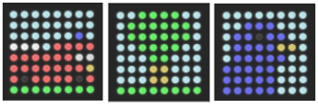

## Display the lighting conditions


Simply scrolling the colours values across the LED matrix is useful but to make the data more interesting for the astronauts, you can alter your program so that it displays a different image depending on what the lighting conditions are. The first step is to create 3 different pictures, one for each of the 3 colours. Below are examples of a red fire engine, a blue bird and a green tree.



What objects do you immediately think of in connection with those colours? A red rose? The blue sea? How easy is it to draw those with just 64 pixels?

--- task ---
Start off by defining the colours you're going to need. 

```python
w = (255, 255, 255) # white
x = (0, 0, 0) # black
g = (0,255,0) # green
s = (180,180,180) # silver
r = (255,0,0) # red
c = (66, 220, 240) # cyan
o = (180,100,0) # orange
b = (0, 0,255) # blue
```

--- /task ---

--- task ---

Then create your pictures in the format of a list as you did before. 

```python
fire_engine = [
    c, c, c, c, c, c, c, c,
    c, c, c, c, c, c, c, c,
    c, c, c, c, c, c, b, c,
    w, w, w, c, r, r, r, r,
    r, r, r, r, r, r, s, s,
    r, r, r, r, r, r, r, o,
    r, x, r, r, r, r, x, r,
    g, g, g, g, g, g, g, g
    ]

bluebird = [
    c, c, c, c, c, c, c, c,
    c, c, b, b, b, c, c, c,
    c, b, b, x, b, b, c, c,
    c, b, b, b, b, o, o, c,
    c, b, b, b, b, b, c, c,
    b, b, b, b, b, c, c, c,
    b, b, b, b, b, c, c, c,
    b, b, b, b, b, c, c, c
    ]

tree = [
    c, c, g, g, g, g, c, c,
    c, g, g, g, g, g, g, c,
    c, g, g, g, g, g, g, c,
    c, c, g, g, g, g, c, c,
    c, c, c, g, g, c, c, c,
    c, c, c, o, o, c, c, c,
    c, c, c, o, o, c, c, c,
    g, g, g, g, g, g, g, g
    ]
```
--- /task ---

--- task ---
Now add a conditional statement to select the right picture depending on the dominant colour according to your measurement. Use the `max()` function to check whether a value for a colour is larger than the largest of the other 2 values. 

```python
if red_light > max(blue_light, green_light):
    sense.set_pixels(fire_engine)
elif blue_light > max(red_light, green_light)
    sense.set_pixels(bluebird)
elif green_light > max(red_light, blue_light)
    sense.set_pixels(tree)
else:
    sense.set_pixels(picture)
```

Why do you need to include a final option to display the original picture of the Flight Case?

--- hints ---
--- hint ---
When checking whether a set of different conditions have been met, it is important to think of every possible outcome and make sure your program can cope.
--- /hint ---
--- hint ---
Without the final `else` clause, what would happen if all three colour values were exactly the same?
--- /hint ---
--- hint ---
In that situation, none of the conditions would be met, so no image would be displayed. Adding the `else` clause ensures that there will always be an image shown. 
--- /hint ---
--- /hints ---
--- /task ---

--- task ---
Test your program by using the colour sliders to simulate light that is mostly red, then green then blue. Make sure the right images is displayed each time. 
--- /task ---
