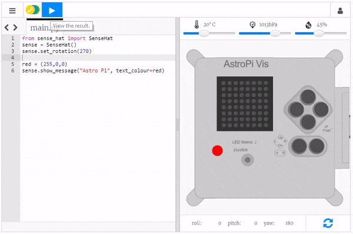

## Lisää väriä

Astro Piin LEDit voivat myös näyttää värejä. Voit määrittää värin luomalla muuttujan ja määrittämällä sille RGB-värin arvon.

Voit oppia, kuinka kaikki värit voidaan luoda tässä käyttämällä erilaisia punaisia, vihreitä ja sinisiä mittasuhteita:

[[[generic-theory-colours]]]

\--- task \---

Valitse väri ja selvitä värin RGB-arvo. Voit käyttää [colour picker](https://www.w3schools.com/colors/colors_rgb.asp){:target="_blank"} auttamaan sinua.

\--- /task \---

\--- task \---

Luo muuttuja tallentamaan valitsemasi väri. Jos esimerkiksi valitsit punaisen, kirjoitat tämän koodin rivin:

```python
red = (255,0,0)
```

\--- /task \---

\--- task \---

Voit nyt näyttää tekstin haluamallasi värillä! Jos haluat ohjata ohjelman käyttämään luomaasi väriä, lisää `text_colour` parametri koodille, joka näyttää tekstisi:

```python
red = (255,0,0)
sense.show_message("Astro Pi", text_colour=red)
```

\--- /task \---



\--- task \---

Voit myös vaihtaa näytön taustaväriä. Valitse toinen väri ja luo toinen muuttuja tallentamaan kyseinen väri. Jos haluat ohjata ohjelman käyttämään valitsemaasi taustaväriä, lisää `back_colour` parametri koodiisi:

```python
red = (255,0,0)
green = (0,255,0)
sense.show_message("Astro Pi", text_colour=red, back_colour=green)
```

\--- /task \---

\--- task \---

Muuta tervehdystekstiä ja väriä - mimkä viestin lähetät ASTA-laitteisiin ISS:ssä?

\--- /task \---