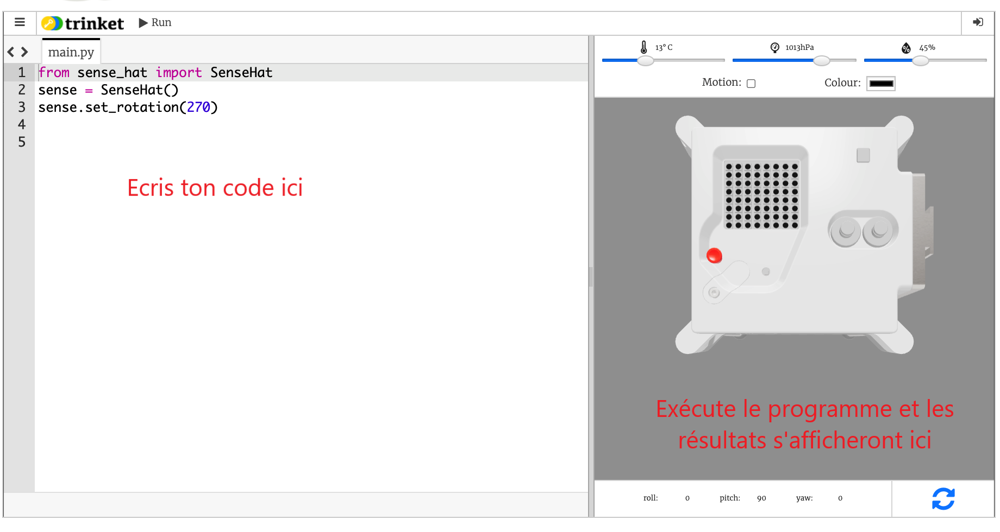

## Qu'est-ce qu'un Astro Pi ?

Un Astro Pi est un ordinateur Raspberry Pi encapsulé dans un boîtier spécialement conçu pour les conditions spatiales. Il possède également une carte supplémentaire appelée Sense HAT, spécialement conçue pour la mission Astro Pi. Le Sense HAT est doté d'un joystick, d'un écran LED et de capteurs pour enregistrer la température, l'humidité, la pression et l'orientation.

Voici une vraie unité Astro Pi dans la station spatiale internationale, exécutant un code écrit par des élèves. C'est là que ton code sera finalement exécuté ! 
<iframe width="560" height="315" src="https://www.youtube.com/embed/4ykbAJeGPMM" frameborder="0" allow="accelerometer; autoplay; encrypted-media; gyroscope; picture-in-picture" allowfullscreen mark="crwd-mark"></iframe> 

Pour cette mission, tu utiliseras l'émulateur Sense HAT. L'émulateur est un logiciel qui simule toutes les fonctions de l'Astro Pi dans ton navigateur Web.

Il existe quelques différences entre le Sense HAT réel et celui qui est émulé :

- Sur l'émulateur, tu peux définir toi-même la température, la pression et l'humidité à l'aide de curseurs, tandis que le véritable Sense HAT de l'Astro Pi utilise des capteurs pour mesurer les valeurs de ces paramètres dans leur environnement.

- Tu peux utiliser utiliser la souris pour cliquer et faire glisser le Sense HAT émulé pour le déplacer et le faire pivoter, afin de simuler des changements d'orientation ; le véritable Astro Pi (et son Sense HAT) peut se déplacer dans le monde réel, et les capteurs d'orientation du Sense HAT détectent quand et comment il s'est déplacé.