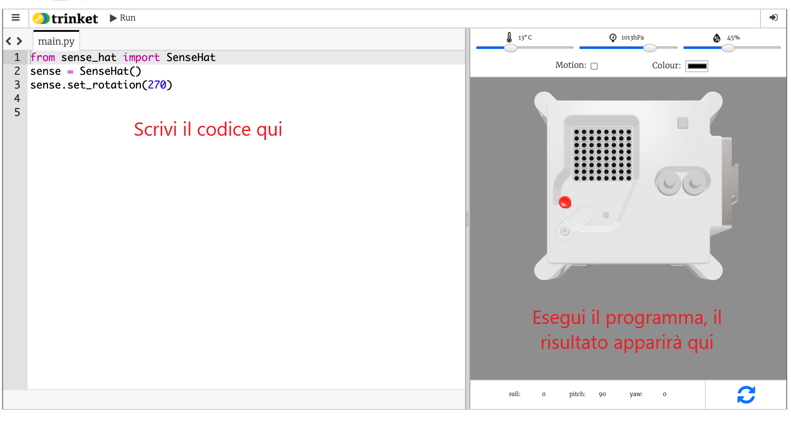

## Che cos'è un Astro Pi?

Un Astro Pi è un computer Raspberry Pi racchiuso in un contenitore appositamente progettato per le condizioni dello spazio. È dotato anche di una scheda aggiuntiva chiamata Sense HAT, realizzata specificamente per la missione Astro Pi. Sense HAT ha un joystick, un display LED e sensori per registrare temperatura, umidità, pressione e orientamento.

Ecco una vera unità Astro Pi sulla Stazione Spaziale Internazionale mentre sta eseguendo del codice scritto da studenti. È qui che verrà eseguito il vostro codice! <iframe src="https://player.vimeo.com/video/172737314" width="640" height="360" frameborder="0" webkitallowfullscreen mozallowfullscreen allowfullscreen mark="crwd-mark"></iframe> 

Per questa missione, utilizzerete l’emulatore Sense HAT. L’emulatore è un software che simula tutte le funzioni dell’Astro Pi nel vostro browser web.

Vi sono alcune differenze fra il Sense HAT vero e la sua emulazione:

- Sull’emulatore, potete impostare voi stessi la temperatura, la pressione e l’umidità usando dei cursori, mentre sul vero Sense HAT dell’Astro Pi questi parametri ambientali sono misurati mediante appositi sensori.

- Sull’emulatore, potete trascinare Sense HAT con il mouse per spostarlo e ruotarlo, simulando cambiamenti nel suo orientamento. Il vero Astro Pi, invece, si muove davvero nel mondo reale e rileva, con i sensori del Sense Hat di cui è dotato, gli spostamenti e il momento in cui avvengono.