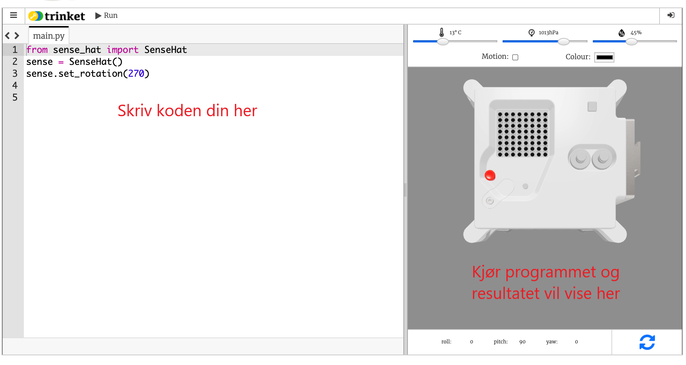

## Hva er en Astro Pi?

En Astro Pi er en Raspberry Pi-datamaskin innkapslet av et hus spesialdesignet for forhold i verdensrommet. Den har også et tilleggskort kalt Sense HAT, laget spesielt for Astro Pi-oppdraget. Sense HAT har en joystick, en LED-skjerm og sensorer for registrering av temperatur, fuktighet, trykk og orientering.

Her er en ekte Astro Pi-enhet på den internasjonale romstasjonen som kjører kode skrevet av elever. Det er her koden deres vil bli kjørt! <iframe width="560" height="315" src="https://www.youtube.com/embed/4ykbAJeGPMM" frameborder="0" allow="accelerometer; autoplay; encrypted-media; gyroscope; picture-in-picture" allowfullscreen mark="crwd-mark"></iframe> 

>

Til dette oppdraget bruker dere Sense HAT-emulatoren. Emulatoren er et program som simulerer alle funksjonene til Astro Pi i nettleseren.

Det er noen forskjeller mellom den virkelige og den emulerte Sense HAT:

- På emulatoren kan du stille inn temperatur, trykk og fuktighet ved hjelp av glidebrytere, mens den virkelige Sense HAT i Astro Pi bruker sensorer til å måle disse parametrene i sitt miljø.

- Du kan bruke musen til å klikke og dra den emulerte Sense HAT for å flytte og rotere den, simulere endringer i retningen; den virkelige Astro Pi (og dens Sense HAT) kan bevege seg i den virkelige verden, og Sense HATs orienteringssensorer oppdager når og hvordan den har flyttet på seg.