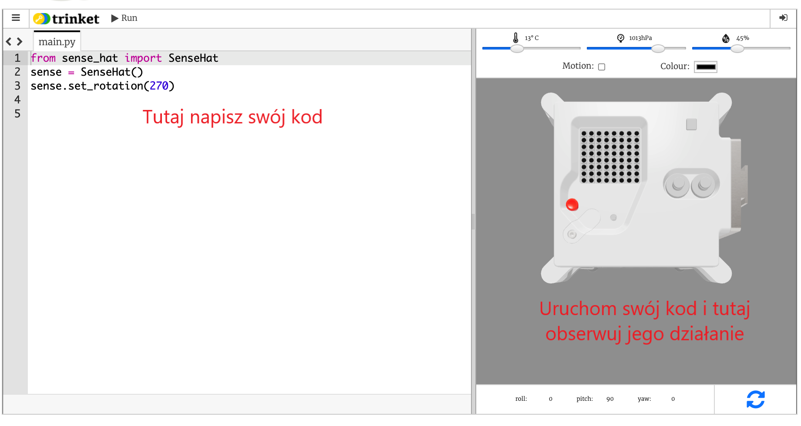

## Czym jest Astro Pi?

Astro Pi to komputer Raspberry Pi z obudową zaprojektowaną specjalnie do pracy w warunkach kosmicznych. It also has an add-on board called the Sense HAT, made specifically for the Astro Pi mission. Ma on również dodatkową tablicę o nazwie Sense HAT, stworzoną specjalnie dla misji Astro Pi. Sense HAT jest wyposażony w joystick, wyświetlacz LED i czujniki do rejestrowania temperatury, wilgotności, ciśnienia i orientacji.

Oto prawdziwa jednostka Astro Pi na Międzynarodowej Stacji Kosmicznej, z uruchomionym kodem napisanym przez uczniów. Your code will eventually be run on a new version of Astro Pi computers!

<iframe width="560" height="315" src="https://www.youtube.com/embed/4ykbAJeGPMM" frameborder="0" allow="accelerometer; autoplay; encrypted-media; gyroscope; picture-in-picture" allowfullscreen mark="crwd-mark"></iframe>>

For this mission, you will be using the Sense HAT emulator. Emulator to oprogramowanie symulujące wszystkie funkcje Astro Pi w przeglądarce internetowej.

Istnieje kilka różnic między prawdziwym a emulowanym Sense HAT:

- Na emulatorze można samodzielnie ustawić temperaturę, ciśnienie i wilgotność za pomocą suwaków, natomiast prawdziwy Sense HAT w Astro Pi wykorzystuje czujniki do mierzenia tych parametrów w swoim otoczeniu.

- Za pomocą myszy można kliknąć i przeciągnąć emulowany HAT Sense, aby go przesunąć i obrócić, symulując zmiany w jego orientacji; prawdziwy Astro Pi (i jego Sense HAT) może poruszać się w świecie rzeczywistym, a czujniki orientacyjne Sense HAT wykrywają, kiedy i jak się porusza.
