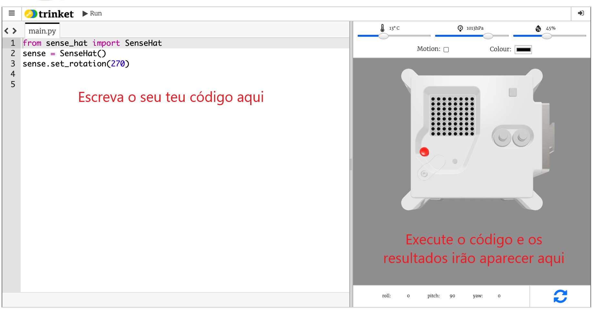

## O que é um Astro Pi?

Um Astro Pi é um computador Raspberry Pi envolto por uma caixa especialmente concebida para as condições no espaço. Inclui também tem uma placa de expansão chamada Sense HAT, criada especificamente para a missão Astro Pi. A Sense HAT possui um joystick, um ecrã LED e sensores para registar a temperatura, a humidade, a pressão e a orientação.

Aqui está uma unidade real do Astro Pi na Estação Espacial Internacional, a executar um código escrito por alunos. Aqui é onde o teu código será executado eventualmente! <iframe width="560" height="315" src="https://www.youtube.com/embed/4ykbAJeGPMM" frameborder="0" allow="accelerometer; autoplay; encrypted-media; gyroscope; picture-in-picture" allowfullscreen mark="crwd-mark"></iframe> 

>

Para esta missão, vais usar o emulador Sense HAT. O emulador é um software que simula todas as funções do Astro Pi no teu navegador.

Existem algumas diferenças entre o Sense HAT real e o emulado:

- No emulador, podes definir a temperatura, a pressão e a humidade tu mesmo, ao usar os controlos de deslize, enquanto o verdadeiro Sense HAT no Astro Pi usa sensores para medir esses parâmetros no seu ambiente.

- Podes usar o rato para clicar e arrastar o Sense HAT emulado para movê-lo e girá-lo, simulando mudanças na sua orientação. O verdadeiro Astro Pi (e o seu Sense HAT) pode mover-se no mundo real, e os sensores de orientação do Sense HAT detetam quando e como se moveu.