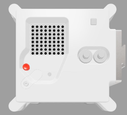

## Introducere

Îmbunătățește rutina zilnică a astronauților de pe Stația Spațială Internațională, arătându-le un mesaj și umiditatea aerului ambiant la bord folosind Sense HAT-ul computerului Astro Pi.

Hardware-ul Mark II Astro Pi este atât de nou încât computerele încă nu au nume încă. Vom numi computerele Astro Pi după doi oameni de știință europeni care ne inspiră. Poți ajuta la alegerea numelor lor votând numele tău preferat ca parte a programului tău Mission Zero.

Vei folosi emulatorul online Sense HAT pentru a crea programul, astfel încât nu este nevoie de hardware suplimentar — totul se face într-un browser web. *Dacă îndeplinește criteriile de eligibilitate* programul completat va fi rulat în spațiu pe Stația Spațială Internațională (ISS)! Vei primi, de asemenea, un certificat special care arată exact unde a fost ISS atunci când a rulat programul tău.

Vom anunța numele câștigătorilor pentru noile calculatoare Astro Pi în primăvara anului 2022.

### Ce vei face

Iată un exemplu al tipului de program pe care l-ai putea face. Dă click pe **Run** pentru a-l vedea în acțiune.

--- collapse ---
---
title: Ce vei învăța
---

Vei învăța despre unitatea Astro Pi și cum să o controlezi, inclusiv cum să:
+ afișezi mesaje și culori
+ creezi imagini
+ măsori umiditatea folosind Sense HAT

Acest proiect acoperă elemente din următoarele componente ale curriculumului [Raspberry Pi Digital Making](http://rpf.io/curriculum){:target="_blank"}:

+ [Folosirea elementelor de bază ale programării pentru a crea programe simple](https://curriculum.raspberrypi.org/programming/creator/){:target="_blank"}

--- /collapse ---

--- collapse ---
---
title: De ce vei avea nevoie
---

### Hardware

+ Orice computer cu o conexiune la internet

### Software

+ Un browser web (de ex. Google Chrome) pentru a deschide [https://trinket.io/mission-zero](https://trinket.io/mission-zero){:target="_blank"}

--- /collapse ---

--- collapse ---
---
title: Note pentru profesori și mentori
---

Această activitate poate fi terminată într-o după-amiază. Organizează-ți elevii în echipe de patru sau mai puțini, și lasă-ne să-i ghidăm să scrie un scurt program în Python pentru a afișa un mesaj personal și umiditatea relativă pe Astro Pi.

Citește [documentul privind instrucțiunile oficiale](https://astro-pi.org/media/mission-zero-guidelines/Astro_Pi_Mission_Zero_Guidelines_2021_22-ro.pdf){:target="_blank"} pentru Mission Zero.

Va trebui să te înregistrezi pentru provocarea Mission Zero pentru a permite echipei/echipelor tale să participe.

+ Accesează [pagina emulatorului Trinket pentru Mission Zero](https://trinket.io/mission-zero){:target="_blank"}.

+ Completează formularul și dă click pe **Submit**\*.

\* Reține că formularul de înregistrare este disponibil doar în engleză.

Câmpurile din formular includ:   
Numele profesorului/mentorului    
Numele echipei   
Numărul membrilor echipei  
Numele și vârsta membrilor echipei  
În ce limbă ai accesat ghidul Mission Zero?

+ Un cont Trinket va fi creat pentru tine (dacă nu ai deja unul, sau nu ești conectat). Poți crea un singur cont folosind o adresă de email. Fiecare cont are propriul său **cod de clasă** pe care va trebui să-l comunici echipei/echipelor tale atunci când sunt gata să-și trimită programele.

+ Afișează codul de clasă undeva vizibil, cum ar fi pe o tablă albă sau utilizând un proiector, iar mai apoi poți începe activitatea.

 Am creat [o broșură printabilă cu 2 pagini](https://astro-pi.org/astro_pi_mission_zero_project_print_out_v10_print/){:target="_blank"} care acoperă punctele cheie ale Mission Zero și pe care studenții și tinerii o pot folosi împreună cu acest proiect online.

--- /collapse ---

